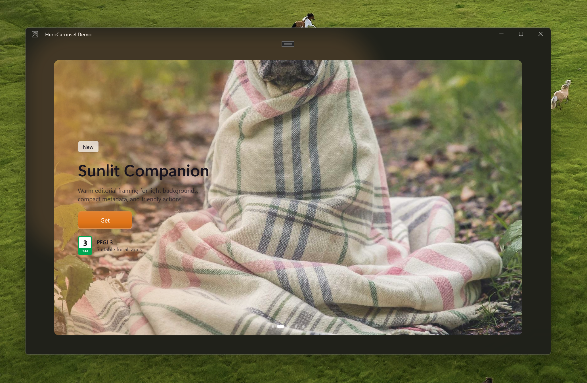

# HeroCarousel.WinUI



`HeroCarousel.WinUI` is a reusable WinUI 3 hero carousel control inspired by the Microsoft Store hero rail. It includes GPU-backed visual effects, shimmer image placeholders, pips, looping navigation, keyboard support, pointer/touch/trackpad gestures, and a demo app that consumes the control as a normal project reference.

## Projects

- `HeroCarousel/`: reusable control library.
- `HeroCarousel.Demo/`: packaged WinUI 3 demo app.

## Features

- Reusable `HeroCarouselView` control.
- `ItemsSource` support plus a built-in `HeroCarouselSlide` model.
- Optional `ContentTemplate` for custom overlay content.
- Optional `PlaceholderTemplate` for custom loading placeholders.
- Default shimmer placeholder for every image while loading.
- Pluggable `IHeroCarouselImageProvider` for `Uri`, `string`, `ImageSource`, or custom async image sources.
- GPU glow, color wash, and pointer spotlight effects through Win2D and ComputeSharp.
- Looping navigation with pips and navigation buttons.
- Touch, trackpad, mouse wheel, pointer drag, and keyboard navigation.

## Requirements

- Windows App SDK 2.0+
- WinUI 3
- `.NET 10.0` Windows target framework
- Windows 10 1809 or newer, matching the project `TargetPlatformMinVersion`

## Use The Control

Reference the library project from a WinUI app:

```xml
<ProjectReference Include="..\HeroCarousel\HeroCarousel.csproj" />
```

Add the XAML namespace:

```xml
<Page
    x:Class="MyApp.MainPage"
    xmlns="http://schemas.microsoft.com/winfx/2006/xaml/presentation"
    xmlns:x="http://schemas.microsoft.com/winfx/2006/xaml"
    xmlns:hero="using:HeroCarousel">

    <hero:HeroCarouselView ItemsSource="{x:Bind Slides}" />
</Page>
```

Create slides:

```csharp
using HeroCarousel;
using Windows.UI;

public IReadOnlyList<HeroCarouselSlide> Slides { get; } =
[
    new()
    {
        Image = new Uri("https://picsum.photos/id/1018/2400/1400"),
        Tag = "Featured",
        Title = "Alpine Signal",
        Subtitle = "A reusable hero card with GPU effects.",
        CtaText = "See details",
        AccentColor = Color.FromArgb(255, 116, 89, 255),
        GlowColor = Color.FromArgb(214, 180, 70, 40),
    },
];
```

## Common Options

- `ItemsSource`: any enumerable item source.
- `Slides`: compatibility collection for `HeroCarouselSlide` items when `ItemsSource` is not set.
- `ContentTemplate`: custom content overlay.
- `PlaceholderTemplate`: custom image placeholder.
- `ImageProvider`: custom async image resolver.
- `ImageStretch`: defaults to `UniformToFill`.
- `IsLoopingEnabled`: defaults to `true`.
- `IsAutoAdvanceEnabled`: defaults to `false`.
- `AutoAdvanceInterval`: defaults to `00:00:06`.
- `PauseAutoAdvanceOnInteraction`: defaults to `true`.
- `ShowNavigationButtons`: defaults to `true`.
- `ShowPips`: compatibility boolean, defaults to `true`.
- `PipsVisibility`: WinUI visibility for the styled `PipsPager`, defaults to `Visible`.
- `UseGlow`: defaults to `true`.
- `UseColorWash`: defaults to `true`.
- `UseSpotlight`: defaults to `true`.
- `UseButtonReveal`: defaults to `true`.
- `ImageCacheCapacity`: defaults to `24`.

## Build

From the repository root:

```powershell
$env:DOTNET_CLI_HOME="$PWD\.dotnet-cli"
$env:DOTNET_SKIP_FIRST_TIME_EXPERIENCE="1"
$Platform = $env:PROCESSOR_ARCHITECTURE
dotnet build .\HeroCarousel.slnx -c Debug -p:Platform=$Platform --no-restore
```

The demo app is MSIX-packaged, so Visual Studio or Windows Developer Mode may be needed for deploy/run workflows.
